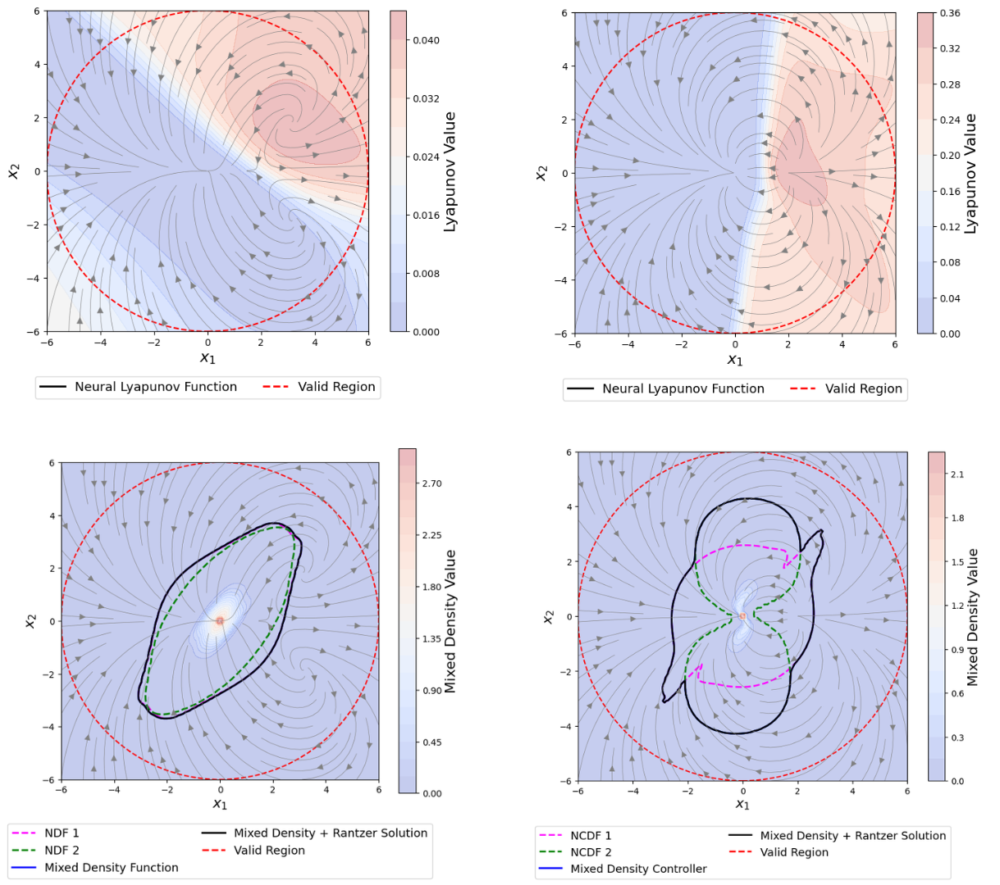
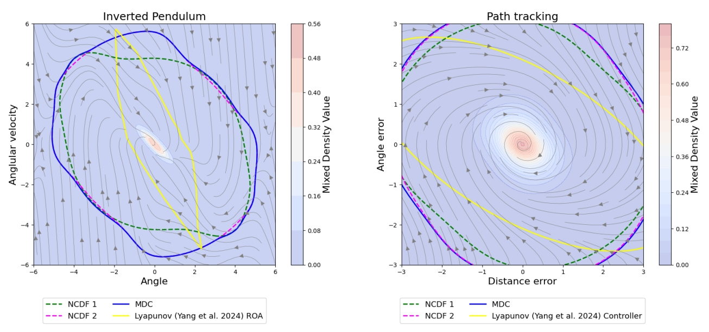
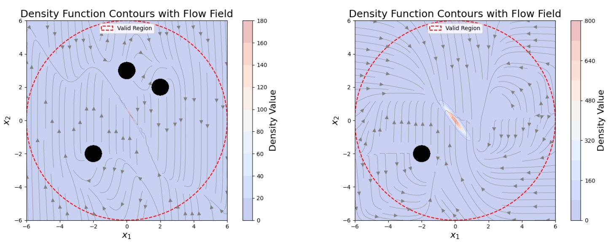

 # Neural Density Control 
 ________________________________________
 Our work studies Neural Network controllers using Density Functions, an alternative to Lyapunov Functions. Lyapunov functions are restrictive to certify stability when there exists multiple equilibria and while the Lyapunov based methods are popular, most CEGIS-Lyapunov based algorithm takes a long time to converge in practice! Our work tackles few of these chalenges with few contributions:
 1. Propose exponential parameterization to learn Neural Control Density Functions (NCDFs) which certifies almost everywhere stability.
 2. Characterize almost everywhere region of attraction (RoA) certified by density functions and show the blended controllers using density functions improves RoA.
 3. Extend the framework to synthesize safe and stable controllers via density and Barrier Functions.

 More details can be bound in our paper:
 Sahil Chaudhary*, Chaitanya Murti* and Chiranjib Bhattacharyya "https://icml.cc/virtual/2026/poster/64872".
__________________________________________
 ## Examples:
 1. We evaluate our method in certifying stability under the presence of multiple equilibria and compare it against Lyapunov Based Method.

|| Examples with multiple equilibria ||
||:--:||
|| ||

2. We also evaluate our method in safe-stable control synthesis with non linear dynamics.

| Pendulum & Path tracking | Examples from Paper|
|:--:| :--:|
| | |
___________________________________________
## Code:
__________________________________________
### Dependencies and Instructions: